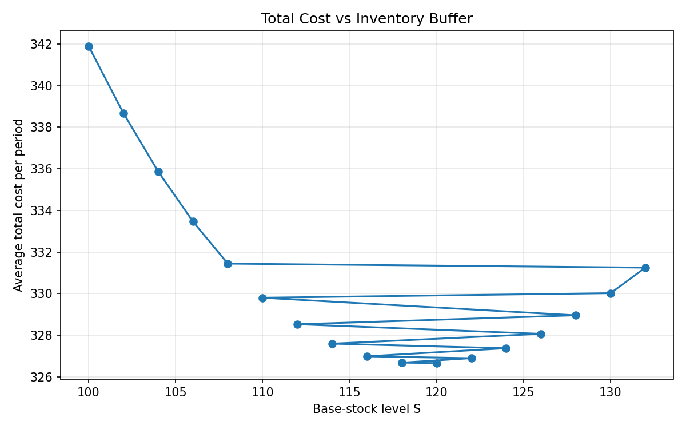
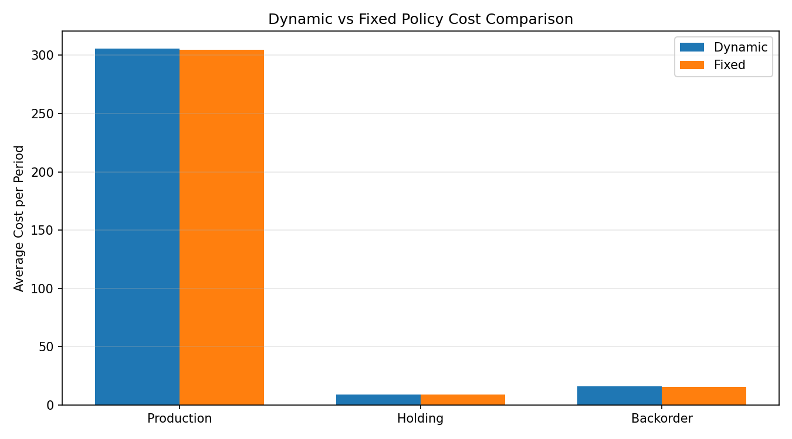
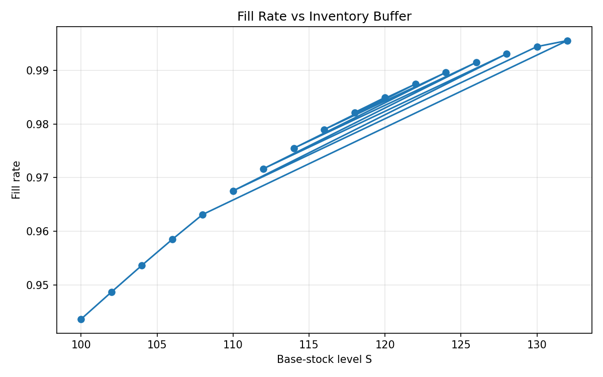
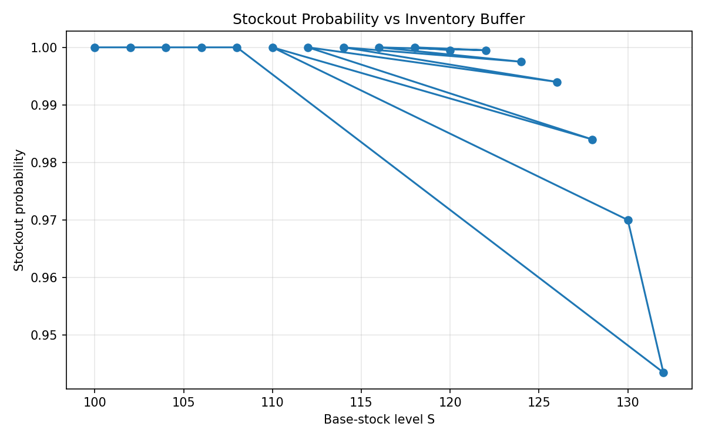
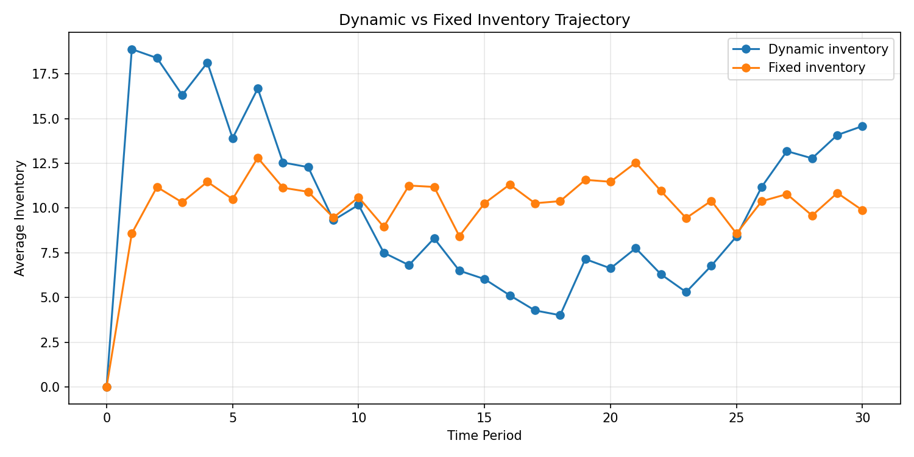
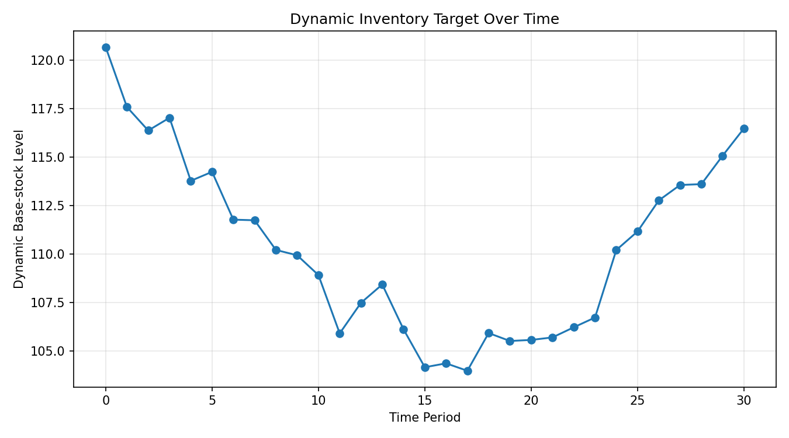

# AI + Operations Research for Agricultural Supply Chains  
## Stochastic Production Planning for a Soybean Processing Facility

---

## Executive Summary

This project demonstrates an end-to-end decision-support system for production and inventory optimization under uncertainty in an agricultural commodity context.

The use case models a soybean processing facility that must balance:

- uncertain weekly demand  
- nonlinear production costs  
- inventory holding costs  
- service risk from backorders  

The solution combines:

- Operations Research (stochastic inventory modeling)  
- Monte Carlo simulation  
- Machine Learning (demand forecasting)  
- KPI and service-risk analytics  
- Python-based production-ready architecture  

---

## Business Problem

A soybean processing facility must decide:

**How much inventory buffer should be maintained to minimize cost while ensuring reliable service?**

Too little inventory:
- increases backorders  
- disrupts customer fulfillment  

Too much inventory:
- increases storage cost  
- ties up working capital  

---

## Model Overview

### Demand

D_t = μ + ε_t  
ε_t ~ N(0, σ²)

---

### Inventory Dynamics

x_(t+1) = x_t + q_t - D_t

---

### Cost Functions

Production Cost  
C(q) = C1*q + 0.5*C2*q²  

Holding Cost  
k(x⁺) = K1*x⁺ + 0.5*K2*(x⁺)²  

Backorder Cost  
b(x⁻) = B1*x⁻ + 0.5*B2*(x⁻)²  

---

### Policy

q_t = max(0, S - x_t)

Goal: Find optimal S*

---

# 🔥 Key Results (ML + OR Integration)

- Optimal fixed base-stock level: **S* ≈ 120**

### Initial ML Attempt

- Forecast Bias: **+3 units**
- Dynamic policy **underperformed** due to:
  - overestimated demand
  - excessive safety stock

### After Calibration

- Tuned service level: **z = 2.20**
- Dynamic policy cost: **328.82**
- Fixed policy cost: **329.00**

✅ **Final Result: ML + OR policy outperformed static policy**

---

## Business Insight

A naïve integration of machine learning into decision systems can increase costs.

However, when properly calibrated:

- bias correction  
- safety stock tuning  

forecast-driven policies can outperform traditional static rules.

### Key takeaway:

Real value comes from combining:

- Predictive modeling (ML)
- Prescriptive optimization (OR)
- Decision calibration

---
---

## 💼 Professional Summary (Resume-Ready)

• Built an end-to-end stochastic production and inventory optimization system under demand uncertainty using Python, combining Operations Research and machine learning  

• Developed Monte Carlo simulation framework to evaluate cost vs service tradeoffs across inventory policies, incorporating nonlinear production, holding, and backorder cost functions  

• Designed and optimized base-stock inventory policy, identifying optimal buffer level (S* ≈ 120) that minimizes total cost while maintaining high service levels  

• Implemented demand forecasting pipeline with feature engineering (lag features, seasonality encoding) and linear regression model, achieving MAE ≈ 6.4 and RMSE ≈ 8.2  

• Integrated ML forecasts into dynamic inventory policy (S_t = μ̂ + zσ̂), enabling adaptive decision-making under uncertainty  

• Conducted policy calibration and sensitivity analysis, demonstrating that naïve ML integration increased costs, while calibrated dynamic policy (z = 2.20) outperformed static policy (328.82 vs 329.00)  

• Built modular, production-ready Python architecture with CLI interface, reusable components, and unit tests (pytest)  

• Generated executive-level insights on cost drivers, service risk, and inventory dynamics through visualization and KPI reporting  


# 📊 Key Visualizations

### Cost vs Inventory Policy


### Cost Breakdown by Policy


### Service vs Risk Tradeoff


### Stockout Risk vs Inventory


### Dynamic vs Fixed Inventory


### Dynamic Inventory Target



---

## Repository Structure

prod-inv-ai-planner/  
├── README.md  
├── configs/  
├── reports/  
│   └── figures/  
├── src/  
└── tests/  

---

## How to Run

```bash
git clone https://github.com/MarioRenatoCarrillo/prod-inv-ai-planner.git
cd prod-inv-ai-planner

python -m venv .venv
source .venv/bin/activate

pip install -r requirements.txt

PYTHONPATH=src python -m prodinv.cli simulate --config ./configs/default.yaml
PYTHONPATH=src python -m prodinv.cli optimize --config ./configs/default.yaml
PYTHONPATH=src python -m prodinv.cli plot --config ./configs/default.yaml

PYTHONPATH=src pytest -q
```

## API

Run the API locally:

```bash
PYTHONPATH=src uvicorn prodinv.api.main:app --reload

```
• Interactive docs available at:

http://127.0.0.1:8000/docs

## Available endpoints:

• GET /health
• POST /simulate
• POST /optimize
• POST /dynamic-policy
Interactive Docs
http://127.0.0.1:8000/docs 

---


## OpenAI Explanation Layer

This project includes an explanation layer built with the OpenAI Responses API.
It transforms optimization outputs into structured executive summaries with:

executive summary
key drivers
recommended action
risk notes

Run the API locally and test the /explain endpoint at:
http://127.0.0.1:8000/docs

---
## OpenAI Explanation Layer

The API includes an `/explain` endpoint that converts optimization outputs into plain-language executive summaries for operations and commercial leaders.

Example use cases:
- explain why a fixed or dynamic policy is preferred
- summarize cost vs service tradeoffs
- highlight forecast bias and calibration implications

---

## AWS Deployment

The API is containerized with Docker and designed for deployment on AWS using:

- Amazon ECR for image storage
- Amazon ECS on Fargate for serverless container hosting
- Application Load Balancer for public HTTP access
- CloudWatch Logs for observability
- AWS Secrets Manager for secure OpenAI key injection

Core endpoints:
- /health
- /simulate
- /optimize
- /dynamic-policy
- /explain

---
## 📊 Interactive Dashboard (Streamlit)

Explore inventory optimization scenarios in real time:

👉 https://<https://app-inv-ai-planner-kgydplba9g53bvhhyr2cgg.streamlit.app/>

### Features

- Compare fixed vs dynamic policies  
- Visualize cost breakdown (production, holding, backorder)  
- Analyze service levels and stockout risk  
- Explore sensitivity to demand variability  

### Run locally

```bash
streamlit run app.py
---

## 🌐 Live API (AWS Deployment)

The API is deployed on AWS ECS Fargate with an Application Load Balancer.

### Endpoints

- GET /health → service status  
- POST /simulate → run inventory simulation  
- POST /optimize → find optimal policy  
- POST /dynamic-policy → ML + OR integration  
- POST /explain → LLM-powered business explanation  

Example:

http://<your-alb-dns>/docs
---

---
## 🏗️ Architecture Diagram

```text
                         ┌───────────────┐
                         │     User      │
                         └───────┬───────┘
                                 │
                                 ▼
                      ┌────────────────────┐
                      │   Application Load │
                      │     Balancer (ALB) │
                      └─────────┬──────────┘
                                │
                                ▼
                   ┌──────────────────────────┐
                   │     ECS Fargate Service  │
                   │  (Containerized Backend) │
                   └─────────┬────────────────┘
                             │
                             ▼
                     ┌────────────────┐
                     │    FastAPI     │
                     │   REST API     │
                     └─────────┬──────┘
                               │
                 ┌─────────────┴─────────────┐
                 ▼                           ▼
       ┌──────────────────┐        ┌────────────────────┐
       │   OpenAI API     │        │ AWS Secrets Manager│
       │  (LLM Services)  │        │ (API Keys & Config)│
       └──────────────────┘        └────────────────────┘

                               │
                               ▼
                      ┌──────────────────┐
                      │   CloudWatch     │
                      │ Logs & Monitoring│
                      └──────────────────┘

                      
### Key Features

- Fully serverless container deployment using AWS ECS Fargate
- Scalable API layer powered by FastAPI
- Secure secret management via AWS Secrets Manager
- Integrated LLM capabilities using OpenAI API
- Centralized logging and monitoring with CloudWatch
```
